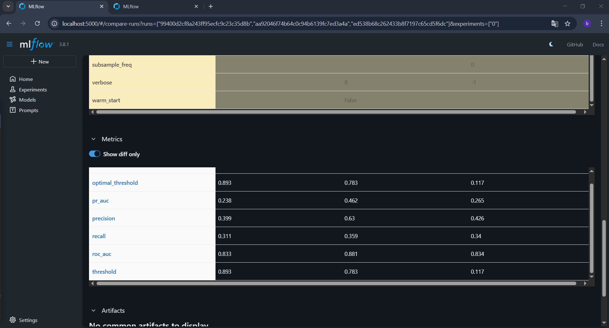
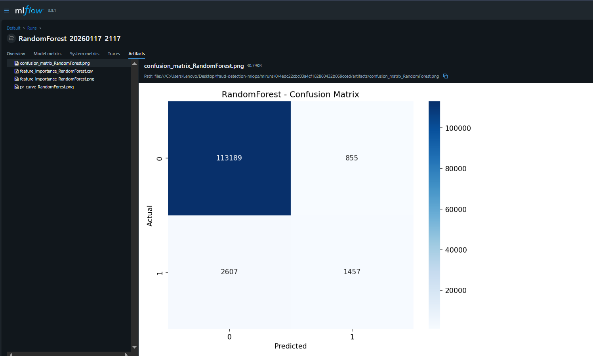
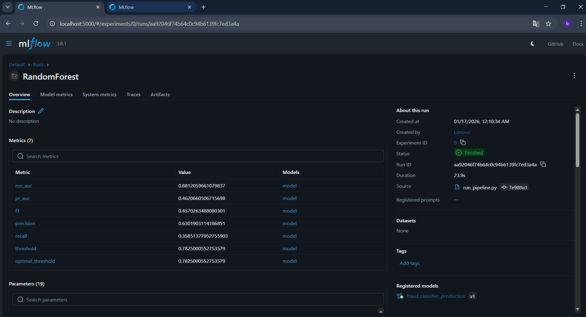
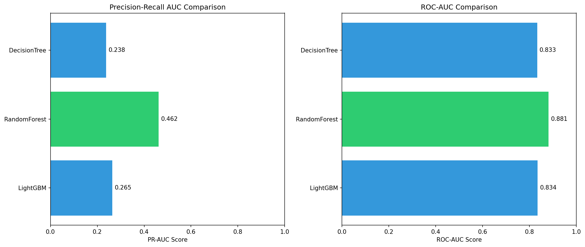
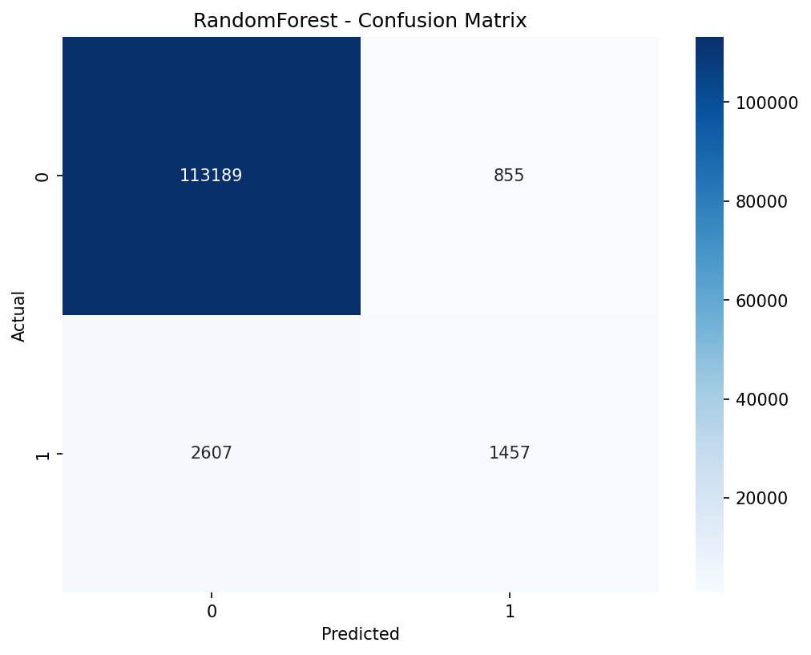
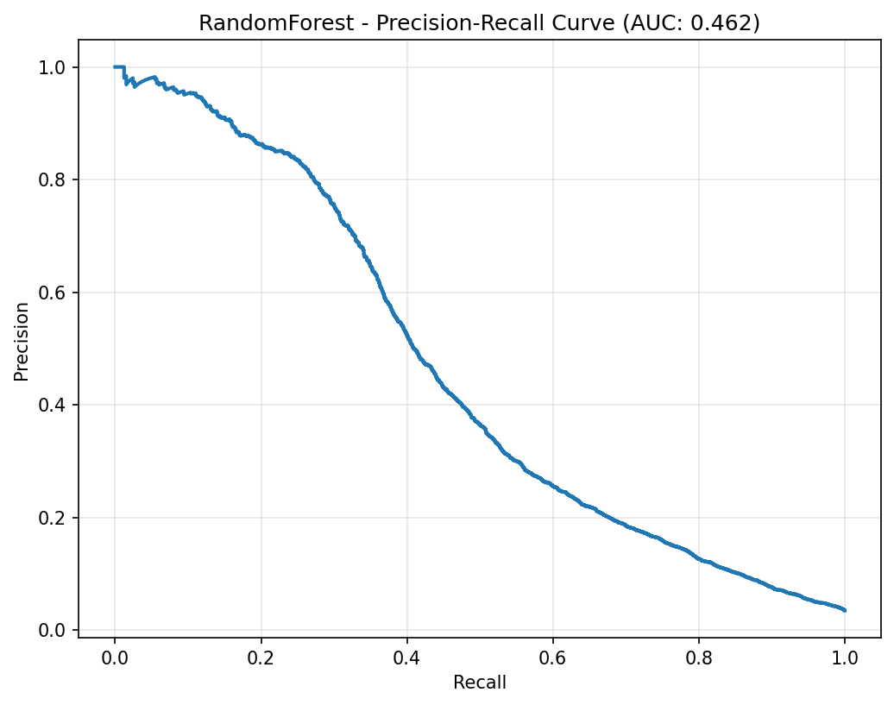
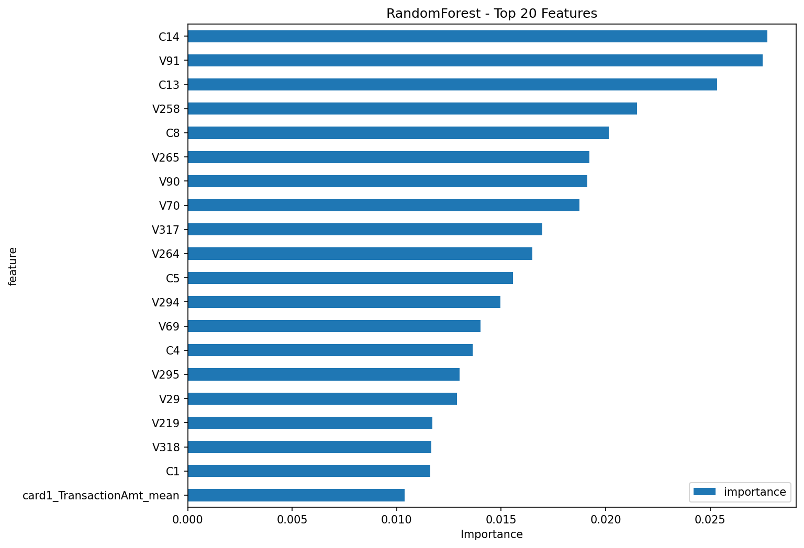

# Fraud Detection MLOps Project

## Production-Grade Machine Learning Pipeline for IEEE-CIS Fraud Detection

[](https://www.python.org/downloads/)
[](https://opensource.org/licenses/MIT)
[](https://mlflow.org/)

---

## Problem Statement

Credit card fraud detection is a critical challenge for financial institutions, with billions of dollars lost annually to fraudulent transactions. This project implements a **production-grade machine learning pipeline** using the [IEEE-CIS Fraud Detection dataset](https://www.kaggle.com/c/ieee-fraud-detection) to identify fraudulent transactions in real-time.

### Key Challenges Addressed

1. **Extreme Class Imbalance**: Only ~3.5% of transactions are fraudulent
2. **High Cardinality Features**: Card and email domain features with thousands of unique values
3. **Missing Data**: Multi-stage imputation handling up to 86% missingness
4. **Temporal Dependencies**: Time-based validation to simulate production drift
5. **Production Deployment**: Model signature support and drift monitoring built-in

---

## Project Architecture

```
fraud-detection-mlops/
├── Data/
│   ├── raw/                    # Original IEEE-CIS dataset
│   ├── processed/              # Feature-engineered data
│   └── features/               # Feature engineering artifacts
├── notebooks/
│   ├── 01_eda_executed.ipynb  # Exploratory Data Analysis
│   └── pipeline_execution.ipynb  # Interactive End-to-End Pipeline
├── src/
│   ├── data_processing.py     # Data loading & validation
│   ├── feature_engineering.py # Feature transformation pipeline
│   ├── train.py               # Enhanced training with MLflow & Visuals
│   └── predict.py             # Inference pipeline with monitoring
├── outputs/
│   ├── visuals/               # Plots (CM, PR-Curve, Importance)
│   ├── models/                # Trained model artifacts
│   └── metrics/               # Performance CSVs
├── mlruns/                    # MLflow experiment tracking
├── requirements.txt           # Python dependencies
└── README.md                  # This file
```

---

## 🔬 Approach & Methodology

### Phase 1: Exploratory Analysis
- **Insights**: Map missing values, analyze hourly/daily transaction volumes, and correlate categorical fraud rates.
- **Visuals**: Check `outputs/visuals/` for target distribution and hourly patterns.

### Phase 2: Enhanced Feature Engineering
- **Optimized Selection**: Automatic dropping of columns with high missing rates (>95% config).
- **Encodings**: Cyclical time encoding, Label encoding for trees, and Frequency encoding for high-cardinality `card` features.
- **Aggregation**: Group-by statistical features for transaction amount and card attributes.

### MLOps Integration: MLflow
Full lifecycle tracking including:
- **Model Signatures**: Defined input/output schemas for deployment.
- **Visual Artifacts**: Confusion Matrix, PR Curves, and Feature Importance logged per run.
- **Threshold Metrics**: Tracking Precision/Recall/F1 at 0.3, 0.5, and 0.7 thresholds.

#### MLflow Dashboard Preview
| Comparison View | Run Artifacts | Model Details |
| :---: | :---: | :---: |
|  |  |  |

---

## 📊 Evaluation Results

### Model Comparison
The following chart compares model performance across ROC-AUC and PR-AUC. **Random Forest** emerged as the superior model for this dataset configuration.



### Performance Matrix

| Model | ROC-AUC | PR-AUC | Status |
|-------|---------|--------|---------|
| **Random Forest** | **0.881** | **0.462** | **Best Model** |
| LightGBM | 0.834 | 0.265 | Baseline |
| Decision Tree | 0.833 | 0.238 | Teacher's Baseline |

### Visualization Samples (Random Forest)

| Confusion Matrix | Precision-Recall Curve | Feature Importance |
| :---: | :---: | :---: |
|  |  |  |

---

## Quick Start

### Installation
```bash
# Clone and enter
git clone https://github.com/yourusername/fraud-detection-mlops.git
cd fraud-detection-mlops

# Setup environment
python -m venv venv
.\venv\Scripts\activate
pip install -r requirements.txt
```

### Run the Pipeline
```bash
# Full pipeline run with customized threshold
python run_pipeline.py --stage all --drop-missing-threshold 0.95 --experiment-name "fraud_v1"
```

### View MLflow Dashboard
```bash
mlflow ui
# Accessible at http://localhost:5000
```

---

## Model Monitoring

The system includes a prediction monitoring suite in `src/predict.py`:
- **Concept Drift**: detects shifts in feature distributions.
- **Performance Tracking**: records average inference time and fraud discovery rates.

---

## Author
**Samir BAIDAR**

---

## License
MIT License - see the LICENSE file for details.

---
**Built for the MLOps community**
